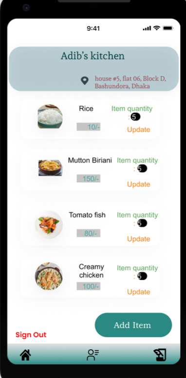
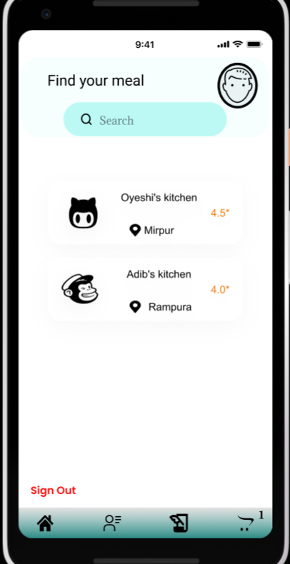
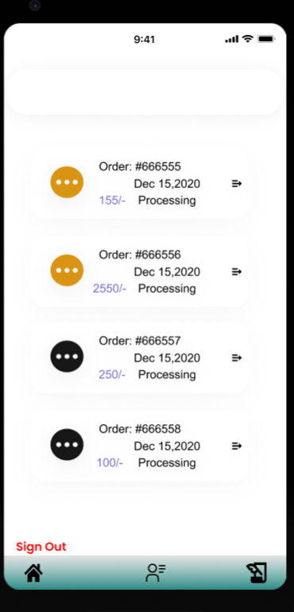
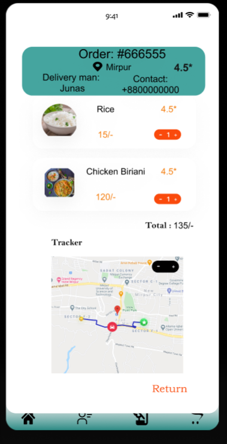
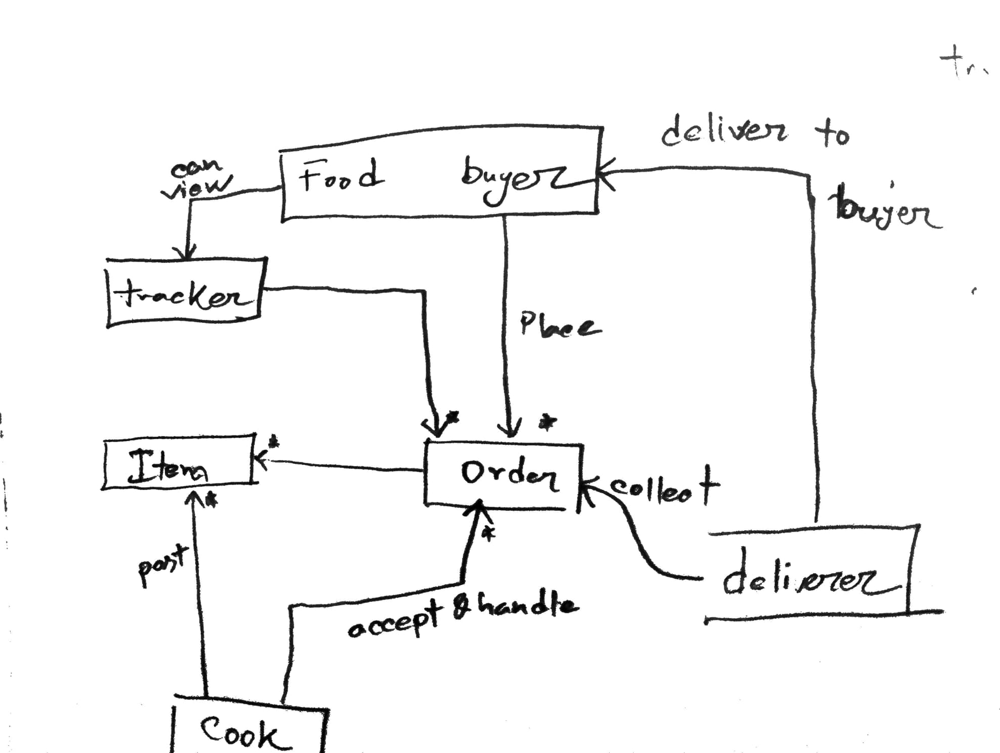

# Project Food delivery app

## Introduction

This app is for dalivery home made food for you. You can sell your homemade food here and the last and also useful for those who want to earn as delivery man. In our app you can easily earn money through selling your food and also delivering foot to the people who ordered it. Here is my first three interface

Through our app you can trackyour food. This will show you where is your order in real time
 

## Features

###food order

###food delivery

###Selling food

## Data management 

In my application first I tried to use MySQL database in my own system. But I have faced some issue related to my environment setup. Then I tried to transfer my backend to firebase. It is a online base database provoided by google. And android studio have lots of function for simplify the use of this database.

## Design pattern 
In this application I have plan to use MVC pattern. Here is the architecture of this app.
 

Here we can see how 3 main activities(deliverer,cook and buyer) are connected to each other. Ther connection is easily observable as Model, View, and Controller architecture.

## Road Blocks
First of all three type of user handleing is not a easy task. Still I could not complete that process in backend. Another challenge is here for me was the view of items. I have useded adopter pattern and recycler view for overcome this issue.

